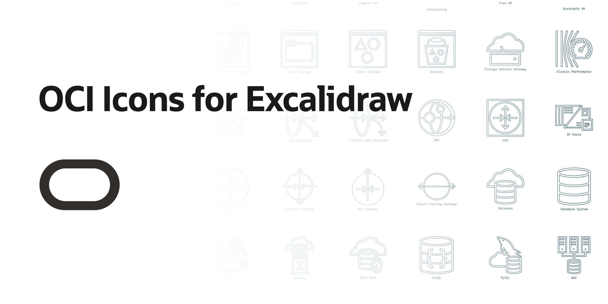

Oracle Cloud Infrastructure (OCI) icon library for Excalidraw

## Install In Excalidraw

1. Open Excalidraw.
2. Open the **Library** panel.
3. Choose **Import**.
4. Select `oci-excalidraw-icons.excalidrawlib` from this repository.

After import, icons are searchable in your Library and can be dropped into diagrams.

## Official OCI Icon Assets

The source OCI icon assets for Powerpoint, draw.io, and Visio can be found here:

- https://docs.oracle.com/en-us/iaas/Content/General/Reference/graphicsfordiagrams.htm

## Icon Catalog

